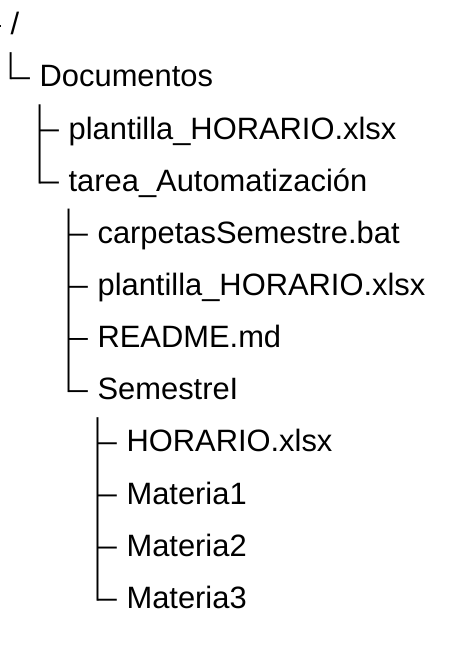

# Automatización en DOS

El programa `carpetasSemestre.bat` está pensado para facilitar la organización en el equipo personal de un estudiante al iniciar un semestre, creando una carpeta con el semestre que va a ser cursado, y dentro de ésta, la cantidad de subcarpetas determinadas por el estudiante según la cantidad de materias que va a cursar, cada una, con el respectivo nombre de la materia. Además se crea un archivo de Excel (`.xlsx`) a partir de una plantilla que se espera que el usuario guarde en la carpeta "Documentos" o "Documents" de su equipo.

## Como iniciar

1. Dentro de la carpeta comprimida que es enviada hay un archivo llamado `plantilla_HORARIO.xlsx`. Dicho archivo debe ser llevado al directorio "Documentos" o "Documents" del equipo del usuario (`%USERPROFILE%\Documents\plantilla_HORARIO.xlsx`).
2. Una vez hecho lo anterior, se puede ejecutar el programa `carpetasSemestre.bat`, éste sin importar la ubicación dentro de la memoria del equipo.

## Ejecución del programa

Al ejecutar `carpetasSemestre.bat`, se le indicará por medio de DOS al usuario los datos necesarios, los cuales deben ser digitados, seguidos de la tecla `Enter` en el siguiente orden:

1. El semestre a cursar (e.g. 2026-II).
2. Cuantas materias se van a cursar, donde se debe ingresar el número (e.g. 4).
3. El nombre de las materias, las cuales se preguntarán una a una según la cantidad que se determinó en el paso anterior (e.g. Computación Gráfica).
4. Al ingresar la última materia, se abrirá automáticamente un archivo de Excel (copia de la plantilla que se debe encontrar en `%USERPROFILE%\Documents\plantilla_HORARIO.xlsx`) dentro de la carpeta del semestre creado, para que el usuario ingrese su respectivo horario.
5. Al terminar de ingresar el horario en Excel, se guardará y cerrará al archivo, para luego presionar cualquier tecla en la ventana de DOS, y finalizar con la ejecución del programa.

## Resultado

Al finalizar la ejecución del programa, se podrá observar en el explorador de archivos de Windows, en la ruta donde se encuentra el programa `carpetasSemestre.bat`, una nueva carpeta con el nombre asignado del semestre a cursar, con subcarpetas para las materias, y un archivo de Excel para el horario del semestre correspondiente.

### Ejemplo

Si se guarda la carpeta "tarea_Automatización" en "Documentos", agregando correctamente la plantilla a dicho directorio, y se ejecuta el programa con un semestre "SemestreI", 3 materias con nombres consecutivos de "Materia1", "Materia2", y "Materia3".

