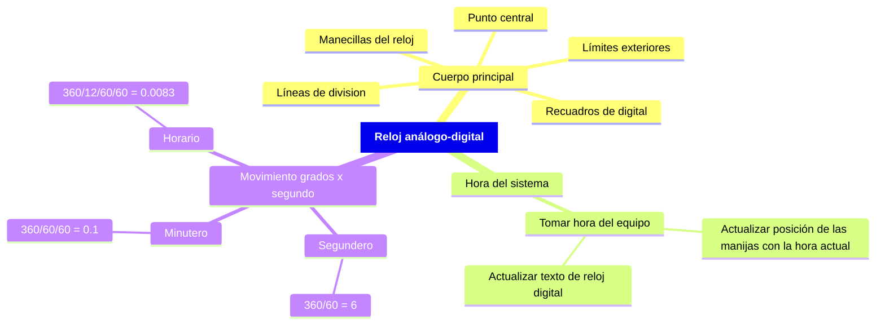

# Reloj análogo-digital

> [!NOTE] Elaborado por:
> ***Alejandro Jiménez Zabala***

> [!TIP] Recordar:
> - [X] Finalizar el programa con `Zoom - Extends`, para visualizar todo lo dibujado
> - [X] Incorporar entrada de usuario para poner en funcionamiento el reloj
> - [ ] Incorporar entrada de usuario para posicionar el reloj
> - [X] Nombrar elementos como variable para facilitar manipulación
> - [X] Agregar "_" a comandos para ejecución desde cualquier equipo configurado con cualquier idioma
> - [X] Mejorar cálculos de los ángulos para ajuste inicial de la hora
> - [ ] Condicionar las actualizaciones del reloj digital
>   - [ ] 60 segundos
>   - [ ] 60 minutos
>   - [ ] 24 horas
>   - [ ] Revisar dias por mes
>   - [ ] 12 meses
>   - [ ] Años bisiesto
> - [ ] Agregar visualización final del reloj al README

- [Reloj análogo-digital](#reloj-análogo-digital)
  - [Introducción](#introducción)
  - [Mapa mental](#mapa-mental)
  - [Desarrollo](#desarrollo)
    - [Cuerpo base del reloj](#cuerpo-base-del-reloj)
    - [Obtener hora](#obtener-hora)
    - [Ajuste a hora obtenida](#ajuste-a-hora-obtenida)
    - [Actualización cada segundo](#actualización-cada-segundo)
      - [Digital](#digital)
      - [Análogo](#análogo)
  - [Ejecución](#ejecución)
    - [Método 1](#método-1)
    - [Método 2](#método-2)
    - [Funcionamiento del reloj](#funcionamiento-del-reloj)
  - [Bibliografía](#bibliografía)

## Introducción

Haciendo uso del programa de AutoDesk, AutoCAD, se puede usar el lenguaje LISP para programación y visualización de un reloj análogo-digital, que muestre la misma hora del sistema, y se actualice debidamente cada segundo.

## Mapa mental

## Desarrollo

Se define el programa como una función para ser ejecutado cuando sea llamado como un comando, es decir, evitando que se ejecute automáticamente solo al cargar el programa, dicha función se deja definida con el nombre `reloj`.
Además, como configuración previa, se apaga el `osnap` para que no hayan inconsistencias entre lo definido en el programa y en el dibujo, y se borra todo lo que haya sido previamente dibujado en AutoCAD previo a la ejecución del programa del reloj.

### Cuerpo base del reloj

### Obtener hora

`(getvar "cdate")` retorna la hora actual de la forma `AAAAMMDD.HHMMSScseg`.

### Ajuste a hora obtenida

Los recuadros "digitales" se actualizan con la hora y la fecha actual del sistema, y las manecillas análogas se ajustan al ángulo según dicha hora; teniendo en cuenta que el horario y el minutero se les suma un ángulo más pequeño, según los segundos que ya hayan transcurrido de la hora y del minuto correspondientes.

### Actualización cada segundo

En un ciclo que se repite la cantidad de segundos que sean definidas por el usuario, se ejecutan los comandos para actualizar debidamente el reloj.

#### Digital

Actualiza el segundo del reloj digital, y se definen las condiciones para que, al llegar a 59 segundos, esta cuenta vuelva a 0, y que según esto, tambien aumenten debidamente los minutos, horas, dias, meses, y años.

#### Análogo

Cada manecilla rota su respectivo ángulo, pasado cada segundo.

## Ejecución

Primero realizar uno de los dos siguientes métodos:

### Método 1

En la pestaña `Manage` de la ventana de AutoCAD, se encuentra una opción `Visual LISP Editor`.
Dentro del editor se puede abrir el [programa del reloj](/CompGraf/Reloj/reloj.lsp), y ejecutar dentro de esta misma ventana con la opción de `Load Current Window`.

### Método 2

En la ventana activa de AutoCAD se puede ejecutar el comando `APPLOAD`, el cuál abre una nueva ventana para cargar aplicaciones personalizadas.
En la ventana emergente, se puede buscar la ubicación de la [aplicación](/CompGraf/Reloj/reloj.lsp) dentro del sistema, se selecciona, y se presiona `LOAD`; posteriormente se puede cerrar ésta ventana.
Si el procedimiento se hizo correctamente, se puede ejecutar la aplicación de la misma manera que se hace cualquier otro comando, escribiendo el nombre de la aplicación `reloj`.

### Funcionamiento del reloj

Si se realizó el método seleccionado correctamente, en la ventana de AutoCAD se solicitará al usuario ingresar los segundos que desea poner en funcionamiento el reloj, a lo que se ingresa el número, y se presiona la tecla `Enter`.

## Bibliografía

- https://help.autodesk.com/view/OARX/2024/ENU/
- https://www.afralisp.net/