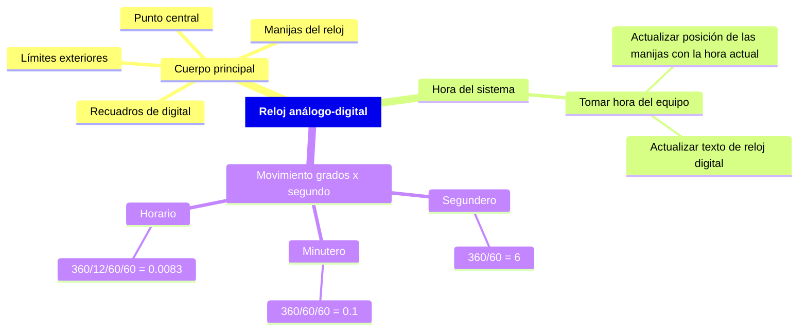

# Reloj análogo-digital

> [!NOTE] Elaborado por:
> ***Alejandro Jiménez Zabala***

> [!TIP] Recordar:
> - [X] Finalizar el programa con `Zoom - Extends`, para visualizar todo lo dibujado
> - [ ] Agregar visualización final del reloj al README

- [Reloj análogo-digital](#reloj-análogo-digital)
  - [Introducción](#introducción)
  - [Mapa mental](#mapa-mental)
  - [Desarrollo](#desarrollo)
    - [Cuerpo base del reloj](#cuerpo-base-del-reloj)
    - [Obtener hora](#obtener-hora)
  - [Ejecución](#ejecución)
    - [Método 1](#método-1)
    - [Método 2](#método-2)

## Introducción

Haciendo uso del programa de AutoDesk, AutoCAD, se puede usar el lenguaje LISP para programación y visualización de un reloj análogo-digital, que muestre la misma hora del sistema, y se actualice debidamente cada segundo.

## Mapa mental

## Desarrollo

Se define el programa como una función para ser ejecutado cuando sea llamado como un comando, es decir, evitando que se ejecute automáticamente solo al cargar el programa, dicha función se deja definida con el nombre `reloj`.
Además, como configuración previa, se apaga el `osnap` para que no hayan inconsistencias entre lo definido en el programa y en el dibujo, y se borra todo lo que haya sido previamente dibujado en AutoCAD previo a la ejecución del programa del reloj.

### Cuerpo base del reloj

### Obtener hora

`(getvar "cdate")` retorna la hora actual de la forma `AAAAMMDD.HHMMSScseg`.

## Ejecución

### Método 1

En la pestaña `Manage` de la ventana de AutoCAD, se encuentra una opción `Visual LISP Editor`.
Dentro del editor se puede abrir el [programa del reloj](/CompGraf/Reloj/reloj.lsp), y ejecutar dentro de esta misma ventana con la opción de `Load Current Window`.

### Método 2

En la ventana activa de AutoCAD se puede ejecutar el comando `APPLOAD`, el cuál abre una nueva ventana para cargar aplicaciones personalizadas.
En la ventana emergente, se puede buscar la ubicación de la [aplicación](/CompGraf/Reloj/reloj.lsp) dentro del sistema, se selecciona, y se presiona `LOAD`; posteriormente se puede cerrar ésta ventana.
Si el procedimiento se hizo correctamente, se puede ejecutar la aplicación de la misma manera que se hace cualquier otro comando, escribiendo el nombre de la aplicación `reloj`.