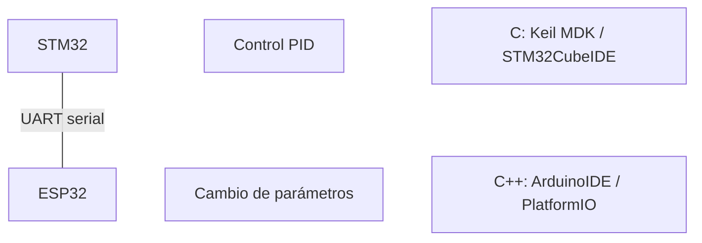

# MicroROS Self-balancing robot

> Robot auto balanceable MicroROS

## Funcionamiento

## Recursos de apoyo

### [Página oficial](https://www.yahboom.net/study/SBR-microROS)

**Unidad 12** - "STM32 Balancing case": Control PID y LQR

### Firmware

#### Balance STM32

#### Firmware de fábrica

### Códigos

#### Modelo matemático

#### MatLab

#### Julia